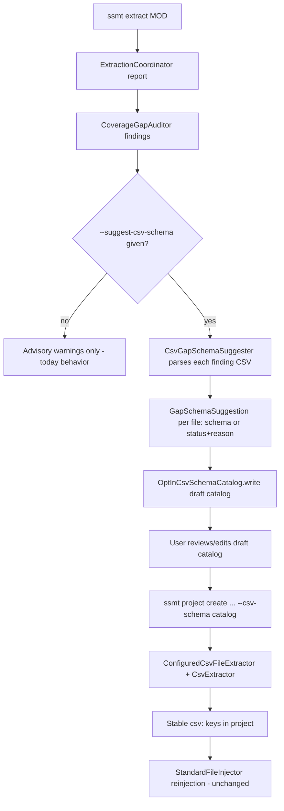

# Gap Coverage Design — Extracting Text from Unrecognized CSVs

Status: implemented (2026-09-05)
Scope: `ssmt-extractor`, `ssmt-cli` (wiring), plus one `ssmt-patcher` bug fix found by the
round-trip test (see §8 note); no other module changes
Supersedes: nothing — extends the ADR-032 evidence-gated coverage policy

---

## 1. Problem statement

A field test against Edmund's Church found `data/hulls/special_items.csv`
containing Chinese text (`#舰船...`-style content and Chinese item names) that:

- no entry in the closed [`StandardCsvSchemas.SCHEMAS`](../../ssmt-extractor/src/main/java/com/ssmt/extractor/csv/StandardCsvSchemas.java:14)
  map recognizes — the standard registry *does* contain
  `data/campaign/special_items.csv` (the vanilla path), but
  [`StandardCsvSchemas.find()`](../../ssmt-extractor/src/main/java/com/ssmt/extractor/csv/StandardCsvSchemas.java:81)
  matches by exact-or-suffix path, and `data/hulls/special_items.csv` does not
  end with `/data/campaign/special_items.csv`;
- no opt-in catalog covers (the user has authored none for this mod).

The file was therefore skipped by
[`ExtractionCoordinator.extractMod()`](../../ssmt-extractor/src/main/java/com/ssmt/extractor/ExtractionCoordinator.java:62)
(landing in `ExtractionReport.skippedFiles`) and subsequently flagged by
[`CoverageGapAuditor.audit()`](../../ssmt-extractor/src/main/java/com/ssmt/extractor/CoverageGapAuditor.java:42)
as an advisory [`CoverageGapFinding`](../../ssmt-extractor/src/main/java/com/ssmt/extractor/CoverageGapFinding.java:13)
— logged by [`ExtractCommand.call()`](../../ssmt-cli/src/main/java/com/ssmt/cli/ExtractCommand.java:61)
as "Possible missed translatable content". **But nothing consumes those
findings**: the strings were not extracted, not added to any project, and can
never be reinjected. The auditor is read-only by design (ADR-032), so today the
only remedy is hand-authoring an opt-in catalog
([`CSV_SCHEMAS.md`](../../CSV_SCHEMAS.md)), which requires the user to know the
catalog format and inspect the CSV columns manually.

Goal: close the loop from *finding* to *extraction* (and thus reinjection) for
unrecognized CSVs with translatable text, without weakening the
evidence-gated policy.

---

## 2. Options considered

### Option A — Add more standard schemas

Add standard entries for more well-known paths (e.g. confirm/keep
`data/campaign/special_items.csv`, which already exists at
[`StandardCsvSchemas.java:43`](../../ssmt-extractor/src/main/java/com/ssmt/extractor/csv/StandardCsvSchemas.java:43)).

Pros:

- Zero user effort; covered forever for every mod once shipped.
- Fully reuses [`StandardCsvFileExtractor`](../../ssmt-extractor/src/main/java/com/ssmt/extractor/csv/StandardCsvFileExtractor.java:14)
  and the existing reinjection path.

Cons:

- **Insufficient for the observed case.** The field-test file is at
  `data/hulls/special_items.csv` — a mod-specific placement. Standard schemas
  are path-keyed; adding `data/hulls/special_items.csv` would wrongly impose a
  vanilla-shaped schema on an arbitrary mod-chosen location, and every new
  mod-specific placement would need another release.
- Evidence-gated policy (ADR-032) requires a human to confirm each field is
  player-visible before standardizing; that gate is per-layout, not automatable.

Verdict: keep doing this when evidence warrants (it is how the registry grew),
but it cannot solve mod-specific placements. Not the primary mechanism.

### Option B — Heuristic auto-extraction behind a flag

A new extractor that claims every unsupported `.csv` containing non-ASCII text
when an explicit flag (e.g. `--gap-coverage`) is set, extracting every cell
with non-ASCII content keyed by inferred row id + column header.

Pros:

- One-flag "just work" experience; no user schema authoring.
- Would have extracted Edmund's Church immediately.

Cons:

- **Violates the spirit of ADR-032**: mass extraction without per-column
  provenance. Non-ASCII ≠ translatable (tags, transliterations, code-like
  tokens, author comments); a heuristic cannot tell.
- Identity inference at extraction time risks *unstable* keys: if the inferred
  id column changes between runs, keys churn and translations orphan.
- New extractor with new error semantics duplicates
  [`CsvExtractor`](../../ssmt-extractor/src/main/java/com/ssmt/extractor/csv/CsvExtractor.java:33)
  behavior (blank ids, duplicate ids, sentinel rows) — maximal new surface.
- A flag-gated silent behavior change is hard to review in the field: the user
  cannot easily see *which* columns were judged translatable.

Verdict: rejected as primary. The same outcome is achievable with provenance by
materializing the heuristic as a *reviewable artifact* (Option C).

### Option C — Auditor-driven assisted opt-in (recommended)

Turn each CSV [`CoverageGapFinding`](../../ssmt-extractor/src/main/java/com/ssmt/extractor/CoverageGapFinding.java:13)
into a **suggested** [`OptInCsvFileSchema`](../../ssmt-extractor/src/main/java/com/ssmt/extractor/csv/OptInCsvFileSchema.java:14)
— infer identity column(s) and candidate text columns from the file's headers
and non-ASCII cells — and emit the suggestions as a standard versioned catalog
(via the existing [`OptInCsvSchemaCatalog.write()`](../../ssmt-extractor/src/main/java/com/ssmt/extractor/csv/OptInCsvSchemaCatalog.java:67))
that the user reviews, edits if needed, and accepts through the existing
`--csv-schema` surface.

Pros:

- **Evidence-gated compliant**: a human accepts each suggested file/column set
  before anything is extracted — the finding stays advisory until approved.
- **Maximal reuse**: accepted suggestions are ordinary opt-in schemas applied
  by [`ConfiguredCsvFileExtractor`](../../ssmt-extractor/src/main/java/com/ssmt/extractor/csv/ConfiguredCsvFileExtractor.java:17)
  → [`CsvExtractor`](../../ssmt-extractor/src/main/java/com/ssmt/extractor/csv/CsvExtractor.java:33);
  stable keys are the existing `csv:...` format, so
  [`StandardFileInjector`](../../ssmt-patcher/src/main/java/com/ssmt/patcher/StandardFileInjector.java:34)
  reinjection works with **zero patcher changes**.
- Durable: the accepted catalog is a small, versioned, diffable artifact the
  user keeps per mod (and can contribute upstream as standard-schema evidence).
- Minimal new surface: one suggester class + one record + one enum + CLI wiring.

Cons:

- Two-step workflow (suggest → review → create project with catalog) instead of
  one flag.
- Inference can be wrong; mitigated because the draft is human-reviewed text.

---

## 3. Recommended approach

**Option C as the single primary mechanism.** Option A continues as usual
registry maintenance (out of scope here). Option B is deliberately not built:
its heuristic is preserved *as data* (the suggested catalog) rather than *as
behavior*, which keeps provenance explicit per ADR-032 while removing the
hand-authoring burden that made gaps persist in practice.

Rationale against the stated criteria:

- **(a) evidence-gated policy** — nothing is extracted until the user passes
  the reviewed catalog via `--csv-schema`; suggestions carry per-file status
  and samples so the decision is informed.
- **(b) reuse** — `CsvExtractionSpec` validation, `OptInCsvFileSchema`,
  `OptInCsvSchema` guards, `OptInCsvSchemaCatalog` read/write,
  `ConfiguredCsvFileExtractor`, `CsvExtractor`, and `CoverageGapFinding` are
  all reused unchanged.
- **(c) round-trip** — keys remain `csv:<identityColumns>=<identity>:<column>`
  (see [`CsvExtractor.stableKey()`](../../ssmt-extractor/src/main/java/com/ssmt/extractor/csv/CsvExtractor.java:192)),
  which [`StandardFileInjector.CSV_KEY`](../../ssmt-patcher/src/main/java/com/ssmt/patcher/StandardFileInjector.java:35)
  already parses and reinjects with stale-source verification.
- **(d) minimal surface** — no new extractor, no report schema change, no
  patcher change, no GUI change.



---

## 4. Detailed specification

### 4.1 New types (module `ssmt-extractor`, package `com.ssmt.extractor`)

#### `GapSchemaStatus` (enum)

```java
public enum GapSchemaStatus {
    SUGGESTED,          // a complete OptInCsvFileSchema was inferred
    NO_ID_COLUMN,       // no header named id and no all-unique non-blank column
    NO_TEXT_COLUMNS,    // id found, but no column has non-ASCII data cells
    UNPARSEABLE         // CSV parse/validation failure; reason carries detail
}
```

#### `GapSchemaSuggestion` (record)

```java
public record GapSchemaSuggestion(
        Path relativeSourceFile,          // mod-relative, from the finding
        GapSchemaStatus status,
        Optional<OptInCsvFileSchema> schema, // present iff status == SUGGESTED
        String reason,                    // diagnostic: sample or failure detail
        int nonAsciiCellCount             // evidence strength for review
) { }
```

#### `CsvGapSchemaSuggester` (final class)

```java
public final class CsvGapSchemaSuggester {

    /**
     * Suggests opt-in CSV schemas for gap findings, in findings order.
     * Non-.csv findings (e.g. .ship) are ignored here; they remain advisory.
     */
    public List<GapSchemaSuggestion> suggest(
            Path modRoot, List<CoverageGapFinding> findings) throws SsmtParseException;

    /** Builds a fresh version-1 catalog from SUGGESTED entries only. */
    public static OptInCsvSchema toCatalog(List<GapSchemaSuggestion> suggestions);

    /** Appends SUGGESTED entries to an existing catalog, skipping paths the
     *  existing catalog already contains; re-validates via OptInCsvSchema
     *  (duplicate-path and standard-overlap guards apply). */
    public static OptInCsvSchema mergeInto(
            OptInCsvSchema existing, List<GapSchemaSuggestion> suggestions);
}
```

**Inference algorithm** (deterministic; per finding whose file ends `.csv`,
case-insensitive):

1. Decode exactly like [`CsvExtractor.utf8ReaderWithoutBom()`](../../ssmt-extractor/src/main/java/com/ssmt/extractor/csv/CsvExtractor.java:83):
   strict UTF-8, deterministic GB18030 fallback, BOM strip. Parse with the same
   `CSVFormat` (header row, `setAllowMissingColumnNames(true)`). Any parse/IO
   failure → `UNPARSEABLE` with the message in `reason` (never throws out of
   `suggest` for content problems; unreadable file → `SsmtParseException`,
   mirroring the auditor).
2. Data rows = all records except rows whose first cell starts with `#`
   (after `stripLeading`) and all-blank rows — the same structural-row
   convention `CsvExtractor` skips and `StandardFileInjector` preserves.
3. **Identity column** (single column; composite suggestions are out of scope):
   1. a header equal to `id` case-insensitively; else
   2. the first header (file order) whose value is non-blank in every data row
      and pairwise-unique across data rows; else
   3. `NO_ID_COLUMN` (the file stays advisory — row order must never become
      identity, per ARCHITECTURE.md stable-identity invariants, and the
      injector matches rows by identity values).
4. **Text columns**: every non-identity header that is non-blank and has at
   least one data-row cell matching the auditor's run pattern
   `[^\x00-\x7F]{2,}` (same as
   [`CoverageGapAuditor.NON_ASCII_RUN`](../../ssmt-extractor/src/main/java/com/ssmt/extractor/CoverageGapAuditor.java:30)),
   in file order. Blank/anonymous headers are never suggested. None → 
   `NO_TEXT_COLUMNS`.
5. Construct `new OptInCsvFileSchema(relativeSourceFile, List.of(idColumn),
   textColumns)` — this routes through `CsvExtractionSpec` validation as the
   single source of column legality. Any `IllegalArgumentException` →
   `UNPARSEABLE` with reason. Success → `SUGGESTED`, with `reason` = the
   finding's sample and `nonAsciiCellCount` = number of matching cells.

`toCatalog` / `mergeInto` produce `new OptInCsvSchema(CURRENT_SCHEMA_VERSION,
files)`; the record's constructor enforces the ≤256-file cap, duplicate-path
rejection, and the standard-handler overlap guard
([`OptInCsvSchema.java:36`](../../ssmt-extractor/src/main/java/com/ssmt/extractor/csv/OptInCsvSchema.java:36)).
Violations surface as `IllegalArgumentException` → reported by the CLI as a
failed write (cannot happen for fresh suggestions, since findings come from
skipped files, but can for `--merge-into` inputs).

### 4.2 CLI surface (module `ssmt-cli`)

Extend [`ExtractCommand`](../../ssmt-cli/src/main/java/com/ssmt/cli/ExtractCommand.java:29):

```text
ssmt extract MOD_DIRECTORY [--suggest-csv-schema DRAFT.json] [--merge-into EXISTING.json]
```

- `--suggest-csv-schema <path>` (picocli `@Option`,
  `Optional<Path> suggestCsvSchema`): after the existing audit loop, run
  `CsvGapSchemaSuggester.suggest(mod.sourceDirectory(), findings)`; build the
  catalog with `toCatalog` (or `mergeInto(new OptInCsvSchemaCatalog().read(
  mergeTarget), suggestions)` when `--merge-into` is present) and write it with
  `OptInCsvSchemaCatalog.write()` (staged, atomic — existing behavior).
- `--merge-into <path>` is only valid together with `--suggest-csv-schema`
  (picocli usage error otherwise).
- Logging: one `LOG.info` per `SUGGESTED` file (`Suggested CSV schema for {}:
  identity={}, textColumns={}`), one `LOG.warn` per non-suggested finding with
  status and reason. Final line: `Wrote N suggested CSV schema file(s) to
  DRAFT.json; review, edit if needed, then pass via --csv-schema`.
- The existing advisory warning text at
  [`ExtractCommand.java:70`](../../ssmt-cli/src/main/java/com/ssmt/cli/ExtractCommand.java:70)
  gains a mention of `--suggest-csv-schema`.
- Exit codes unchanged: suggestion failures are per-file statuses, not command
  failures; unreadable files keep the current `SsmtParseException` → exit 1.

No changes to `project create` / `--csv-schema`
([`ProjectCommand`](../../ssmt-cli/src/main/java/com/ssmt/cli/ProjectCommand.java:152)):
the reviewed draft *is* a normal catalog. GUI needs no change — "Create with
CSV Schema" already opens any catalog file.

### 4.3 Key format and reinjection compatibility

Unchanged. Accepted suggestions extract through `CsvExtractor`, producing
[`ExtractedString`](../../ssmt-core/src/main/java/com/ssmt/core/model/ExtractedString.java:15)
records with:

```text
key          = csv:<percent-encoded identity columns, ","-joined>
               =<percent-encoded identity values, \0-joined>
               :<percent-encoded column>
example      = csv:id=church_relic:name
sourceFile   = data/hulls/special_items.csv   (mod-relative)
lineNumber   = -1
```

[`StandardFileInjector.replaceCsv()`](../../ssmt-patcher/src/main/java/com/ssmt/patcher/StandardFileInjector.java:298)
already parses this exact shape, matches the row by identity column values,
verifies the original text (stale-source guard), and rewrites only the target
cell — structural `#`/blank rows are re-emitted byte-identical. **No patcher
work is required.**

### 4.4 Error semantics (all inherited, none new)

Because suggestions become ordinary opt-in schemas, extraction-time behavior is
exactly today's opt-in behavior:

| Condition | Behavior | Origin |
|---|---|---|
| Malformed CSV at extraction | `SsmtParseException("Malformed CSV: ...")` | `CsvExtractor.extract` |
| Suggested column absent from header | identity columns required → error; suggested text columns become `optionalTextColumns` via `OptInCsvFileSchema.toSpec()` → skipped, not an error | `CsvExtractor.validateHeaders`, `OptInCsvFileSchema.toSpec` |
| Blank identity | error unless localizable cells blank / sentinel row; opt-in specs use `skipUnidentifiedRows=true` so unidentified rows are skipped | `CsvExtractor.extractRecords`, `OptInCsvFileSchema.toSpec` |
| Duplicate identity | `SsmtParseException("Duplicate CSV identity: ...")` | `CsvExtractor.extractRecords` |
| `#`-prefixed rows, blank rows | skipped | `CsvExtractor.extractRecords` |
| Empty text cell | not extracted | `CsvExtractor.extractRecords` |

Suggestion-time problems are statuses (`UNPARSEABLE`, `NO_ID_COLUMN`,
`NO_TEXT_COLUMNS`), never command failures — the suggester is advisory.

### 4.5 Attribution in `ExtractionReport`

**No `ExtractionReport` change.** Once a catalog is accepted, gap-derived
strings are indistinguishable from hand-authored opt-in strings — correct,
because they *are* opt-in strings — and are attributed by
`ExtractedString.sourceFile` (`data/hulls/special_items.csv`) and their `csv:`
key inside `report.strings()`; the file correspondingly disappears from
`report.skippedFiles()` and therefore from the auditor's next run. The
suggestion step's attribution lives in the CLI log lines and in the draft
catalog itself (each file entry is one accepted finding).

---

## 5. Test plan

### 5.1 New unit tests

`ssmt-extractor/src/test/java/com/ssmt/extractor/CsvGapSchemaSuggesterTest.java`:

- `suggestsSchemaForUnrecognizedCsvWithIdAndNonAsciiText` — fixture shaped like
  the field-test file (`data/hulls/special_items.csv`, header
  `id,name,desc,cost`, Chinese `name`/`desc`, ASCII `cost`) → `SUGGESTED`,
  identity `id`, text columns `[name, desc]` in file order, `cost` excluded.
- `prefersHeaderNamedIdCaseInsensitively` — header `ID` wins over a later
  all-unique column.
- `fallsBackToFirstUniqueNonBlankColumn` — no `id` header; first column unique
  and non-blank → chosen; a later unique column is not preferred.
- `reportsNoIdColumnWhenNoColumnIsUniqueAndNonBlank` — duplicate ids →
  `NO_ID_COLUMN`, schema empty.
- `reportsNoTextColumnsWhenAllCellsAreAscii`.
- `ignoresHashCommentAndBlankRowsDuringInference` — `#舰船...` comment rows and
  blank rows do not contribute text columns or break uniqueness.
- `reportsUnparseableForMalformedCsv` — e.g. duplicate header names.
- `ignoresNonCsvFindings` — `.ship` finding → no suggestion emitted.
- `decodesGb18030FallbackContent` — GB18030-encoded fixture still inferred.
- `toCatalogEmitsOnlySuggestedEntries` and `mergeIntoSkipsExistingPathsAndKeepsGuards`
  — merge dedupe; standard-overlap/duplicate guards re-validated.

### 5.2 Extended tests

- [`ExtractCommandTest`](../../ssmt-cli/src/test/java/com/ssmt/cli/ExtractCommandTest.java):
  `--suggest-csv-schema` writes a valid catalog readable by
  `OptInCsvSchemaCatalog.read`; without the flag, behavior is byte-identical to
  today; `--merge-into` without `--suggest-csv-schema` is a usage error.
- [`OptInCsvSchemaCatalogTest`](../../ssmt-extractor/src/test/java/com/ssmt/extractor/csv/OptInCsvSchemaCatalogTest.java):
  no change needed (write/read round-trip already covered).
- Round-trip proof (one new test, a new `GapCoverageRoundTripTest` in
  `ssmt-project` — the first module whose test classpath sees both
  `ssmt-extractor` and `ssmt-patcher`, since neither depends on the other):
  suggest → `toCatalog` → `ConfiguredCsvFileExtractor.extract` on the fixture
  → feed one extracted key + original text to `StandardFileInjector.inject` →
  assert the translated cell replaced and structural rows preserved.

### 5.3 Fixtures

- `ssmt-extractor/src/test/resources/fixtures/mod/data/hulls/special_items.csv`
  — mirrors Edmund's Church: header `id,name,desc,cost`; one `#`-comment row
  containing Chinese (`#舰船...`); Chinese `name`/`desc` values; ASCII `cost`.
- A GB18030-encoded variant for the fallback test (written by the test itself,
  as existing tests write temp files, to avoid encoding ambiguity in the repo).

### 5.4 Manual verification (Edmund's Church field test)

1. `ssmt extract <EdmundsChurchMod> --suggest-csv-schema draft.csv.json`
   → expect a log line suggesting `data/hulls/special_items.csv` and a draft
   catalog containing that path with `identityColumns: ["id"]` and the Chinese
   text columns.
2. Review/edit `draft.csv.json`.
3. `ssmt project create <EdmundsChurchMod> project.json --patch-id ec.zh-en --patch-name "EC" --csv-schema draft.csv.json`
   → expect project entries keyed `csv:id=<item>:name` etc. for
   `data/hulls/special_items.csv`; re-running `ssmt extract` on the same mod
   with the catalog no longer flags the file.
4. Translate one entry, build the patch, and confirm the translated clone's
   `special_items.csv` has the replaced cell with all other bytes/rows intact.

---

## 6. Risks & edge cases

| Risk | Mitigation |
|---|---|
| False positives: non-translatable non-ASCII cells (tags, tokens, author notes) | Suggestions are advisory; text columns only become extractable after human review of the draft. `#`-prefixed rows are excluded from inference entirely, so `#舰船...` comment rows do not pollute suggestions (they also cannot be extracted later — matching `CsvExtractor` skip behavior; if such a comment row is the *only* Chinese content, the file yields `NO_TEXT_COLUMNS` and stays advisory — correct, since comment rows are not reinjectable data). |
| Cell values that merely *start* with `#` in non-first columns | Treated as data (only first-cell `#` marks structural rows) — identical to `CsvExtractor`/`StandardFileInjector` conventions, so extract and inject stay symmetric. |
| Column-name collisions / duplicate headers | Parse fails → `UNPARSEABLE`; duplicate headers already error in `CsvExtractor.validateHeaders`. Blank/anonymous headers are never suggested. |
| CSV with no id column | `NO_ID_COLUMN`; file remains an advisory finding. Row-number identities are deliberately forbidden (row order is not identity; the injector could not match rows). User may still hand-author a composite-identity schema. |
| Duplicate ids discovered only at extraction | Inherited error `Duplicate CSV identity` — same as any opt-in schema; user fixes the catalog (composite identity) or reports a source bug. Suggester could see duplicates too and reports them via `NO_ID_COLUMN` (uniqueness requirement), steering the user early. |
| Standard-handler overlap guard | Findings derive from `skippedFiles`, so fresh suggestions cannot overlap standard schemas; `mergeInto` re-runs the `OptInCsvSchema` constructor guards anyway (duplicate paths, standard overlap, 256-file cap). |
| Suffix-matching subtlety | A mod file at `x/data/campaign/special_items.csv` *would* match the standard schema by suffix and never becomes a finding — unchanged behavior, no gap. |
| Encoding edge cases | Same strict UTF-8 → GB18030 policy as `CsvExtractor` and the auditor; no new guessing. |
| `.ship`/JSON-like gaps | Out of the CSV suggester's scope; findings for them keep today's advisory logging. JSON gaps already have the opt-in JSON catalog route. |
| Draft catalog drift (mod updates columns) | Opt-in extraction fails loudly on missing identity columns (existing semantics) — stale catalogs cannot silently mis-extract. |

---

## 7. Out of scope

- GUI changes: none needed — the existing "Create with CSV Schema" chooser
  accepts the reviewed draft catalog as-is.
- JSON/`.ship` gap coverage: JSON-like gaps are already opt-in-eligible via the
  JSON schema catalog; a `.ship` suggester is a possible follow-up, not here.
- Option B (flag-gated heuristic auto-extraction): rejected as primary; its
  heuristic survives only as reviewable suggestion data.
- New `StandardCsvSchemas` entries: registry growth stays evidence-gated and
  release-driven; `data/hulls/special_items.csv` is mod-specific and must not
  be standardized.
- Composite-identity suggestions, multi-column id inference, and automatic
  catalog acceptance without review.
- Changes to `ExtractionReport`, `ssmt-patcher`, `ssmt-project`, or `ssmt-gui`.

---

## 8. Implementation checklist (single follow-up code subtask)

1. Add `GapSchemaStatus`, `GapSchemaSuggestion`, `CsvGapSchemaSuggester` to
   `ssmt-extractor` (package `com.ssmt.extractor`).
2. Add `CsvGapSchemaSuggesterTest` + fixture
   `fixtures/mod/data/hulls/special_items.csv`.
3. Wire `--suggest-csv-schema` / `--merge-into` into `ExtractCommand`; extend
   `ExtractCommandTest`.
4. Add the suggest→extract→inject round-trip test.
5. Update `CSV_SCHEMAS.md` with a "Gap coverage suggestions" section and the
   advisory warning text in `ExtractCommand`.
6. Run full `gradlew build` (checkstyle included) and the manual field-test
   steps in §5.4.

### Implementation note (deviation from §4.3)

§4.3 asserted "no patcher work is required". The round-trip test
(`ssmt-project/src/test/java/com/ssmt/project/GapCoverageRoundTripTest.java`) disproved
that for the exact field-test shape: `StandardFileInjector.injectCsv` looked every header
up by name for every record, so a structural `#` comment row carrying fewer cells than
the header (the `#舰船...` row in `data/hulls/special_items.csv`) failed with
`Index for header 'name' is 1 but CSVRecord only has 1 values!`. The injector now maps
headers by position with a bounds check and treats absent trailing cells as empty.
Unchanged structural rows are still re-emitted from their raw source text, so existing
full-width comment/blank-row behavior stays byte-identical. Regression test:
`StandardFileInjectorTest.preservesShortHashCommentRowDuringCsvInjection`.
